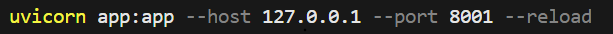
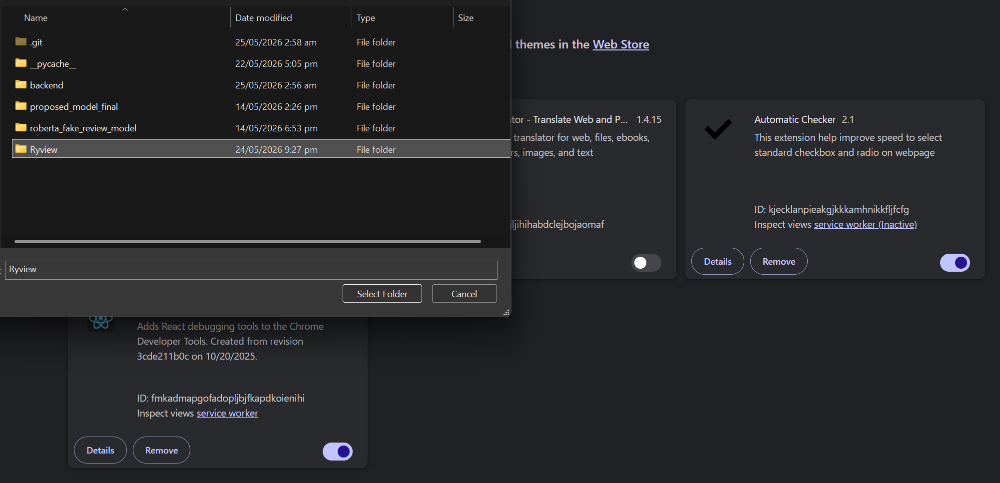
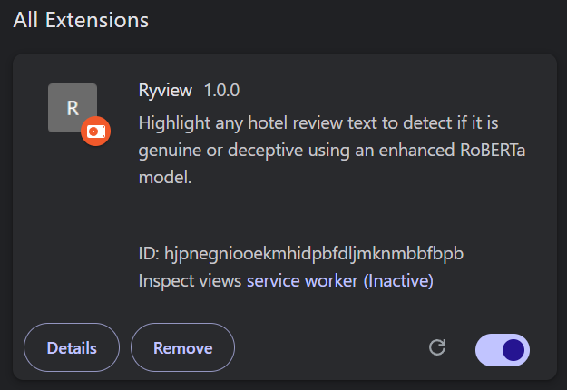
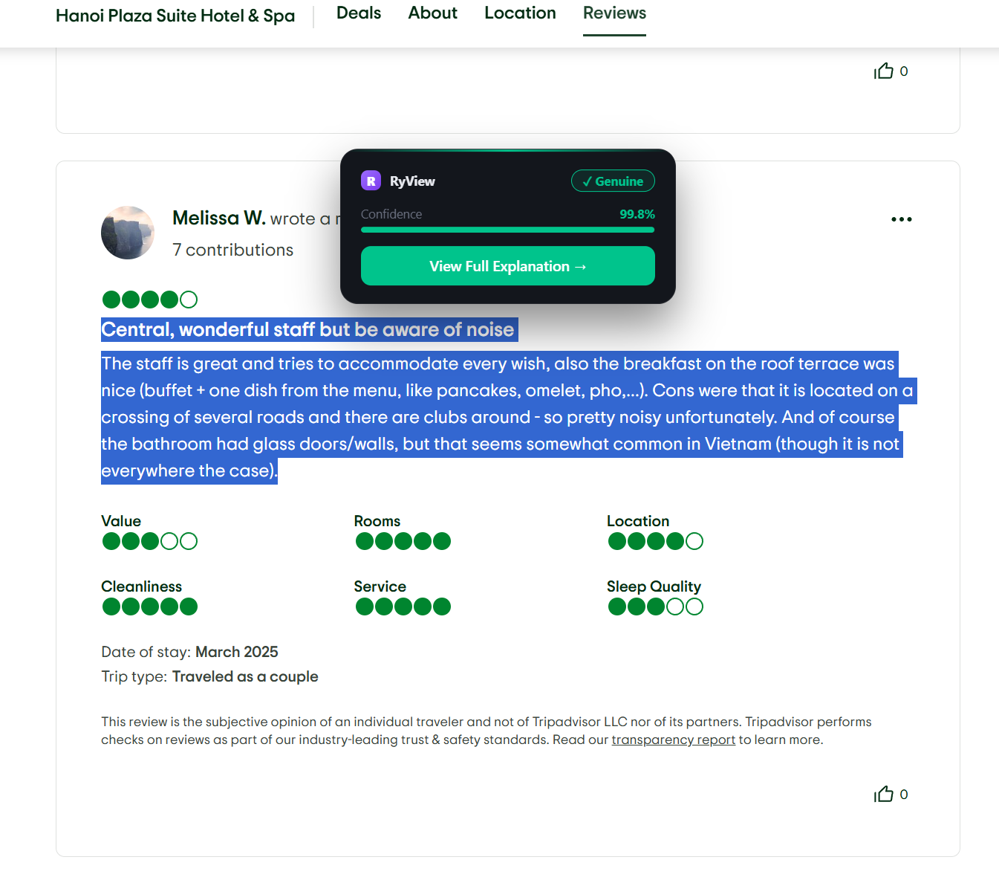

RYVIEW

A BROWSER EXTENSION PROTOTYPE POWERED BY OUR REIMAGINED ROBERTA MODEL TO DETECTS DECEPTIVE HOTEL REVIEWS

TO MAKE THIS EXTENSION WORK, FOLLOW THESE STEPS:

STEP 1:
- DOWNLOAD THIS REPO AS A ZIP FILE AND EXTRACT IN YOUR DESIRE DIRECTORY

STEP 2:
- OPEN THE FILE IN YOUR IDE AND GO INSIDE THE BACKEND FILE

STEP 3:
- RUN THIS COMMAND LINE

STEP 4:
- OPEN "MANAGE EXTENSIONS" OF YOUR DESIRE BROWSER AND MAKE SURE TO TURN ON THE DEVELOPER MODE

STEP 5:
- LOAD UNPACKED FILE ADD SELECT "Ryview" FILE INSIDE THIS FILE TO ADD THE EXTENSION

STEP 6:
- GO TO tripadvisor.com OR ANY SITES WITH HOTEL REVIEWS AND HIGHLIGHT THE DESIRE REVIEWS

STEP 7:
- CLICK "VIEW FULL EXPLANATION" TO OPEN A NEW TAB WITH DETAILED EXPLANATION AND ANALYSIS ON WHY IT FLAGGED THE REVIEW AS A GENUINE/DECEPTIVE

NOW, ENJOY THE RYVIEW EXTENSION!!!